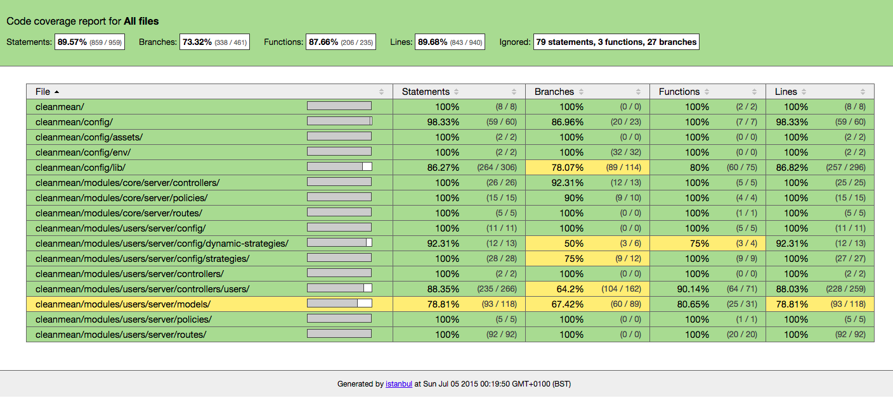

# CleanMean

It's cleaned, reorganised fork of [MEANJS](https://github.com/meanjs/mean). We use it in our projects:

 * [Memeto](https://github.com/sielayltd/memeto)
 * [Meanalitics](https://github.com/sielayltd/meanalitics)

All credit to great team maintaining MEANJS. Anyhow we wanted to do few things our way and we had to improve testability.

This chunk of code is kept under MIT, so it can be freely used and merged back to original MEANJS project.

For most of technical information please go to MEANJS.

## Main differences

 * Identity management - multiple identities for user, it's applied as PR to MEANJS already
 * High test coverage
 * Improved security in couple of places
 * Introduced RAML documentation for API that supports tests
 * Reorganised UI a bit
 * Integration with OrientDB
 * We dropped GRUNT
 * We require JSHint to pass proper to run app or test
 * We format code a bit in the different way

## Testing

 * You can test with OrientDB disabled (then set in environment config empty config for it) or you have to create orientDB to make all work.

## License

(The MIT License)

Permission is hereby granted, free of charge, to any person obtaining a copy of this software and associated documentation files (the 'Software'), to deal in the Software without restriction, including without limitation the rights to use, copy, modify, merge, publish, distribute, sublicense, and/or sell copies of the Software, and to permit persons to whom the Software is furnished to do so, subject to the following conditions:

The above copyright notice and this permission notice shall be included in all copies or substantial portions of the Software.

THE SOFTWARE IS PROVIDED 'AS IS', WITHOUT WARRANTY OF ANY KIND, EXPRESS OR IMPLIED, INCLUDING BUT NOT LIMITED TO THE WARRANTIES OF MERCHANTABILITY, FITNESS FOR A PARTICULAR PURPOSE AND NONINFRINGEMENT. IN NO EVENT SHALL THE AUTHORS OR COPYRIGHT HOLDERS BE LIABLE FOR ANY CLAIM, DAMAGES OR OTHER LIABILITY, WHETHER IN AN ACTION OF CONTRACT, TORT OR OTHERWISE, ARISING FROM, OUT OF OR IN CONNECTION WITH THE SOFTWARE OR THE USE OR OTHER DEALINGS IN THE SOFTWARE.
